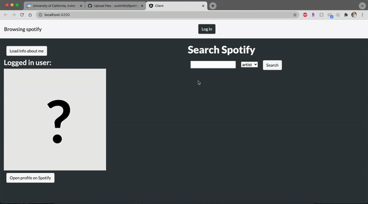

Angular, TypeScript, HTML

I used these languages and the Spotify Developer API to build a Spotify Web Browser. Some of the functions are displaying user information, displaying artist/track/album information, and being able to click and interact with these features.

TypeScript was used to implement key functions such as fetching and processing data about artists, albums, related artists, track features, and components (like the thermometers on the track page). Angular was used to bind artist names, album names, images, and components to the HTML files. 

From this project, I learned how to use Angular to bind data to HTML so that web pages are dynamic. I also realized how powerful these tools are in making any type of website.

*Actual files available on request. I did not upload them here because of academic integrity
